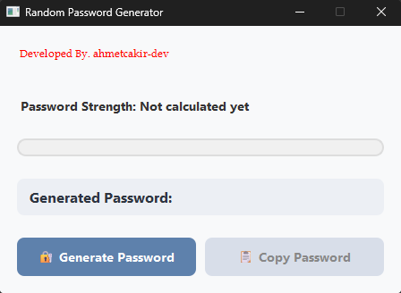

# Random Password Generator 🔑

A simple and useful **random password generator** built with **Python** and **PyQt6**.  
It provides a clean graphical interface, unlimited password generation, and a built-in password strength indicator.

---

## ✨ Features
- 🖥️ User-friendly PyQt6 interface (medium-level GUI)
- 🔐 Unlimited random password generation
- 📊 Password strength indicator (weak, medium, strong)
- ⚡ Fast and simple to use

---

## 📸 Demo  


---

## 🚀 Installation

1. Clone the repository:
   ```bash
   git clone https://github.com/ahmetcakir-dev/password-generator.git
   cd password-generator
   ```

2. Install dependencies:
   ```bash
   pip install -r requirements.txt
   ```

3. Run the application:
   ```bash
   python password-generator.py
   ```

---

## 📦 Requirements
- Python 3.9+
- PyQt6

Install requirements:
```bash
pip install PyQt6
```

---

## 📂 Project Structure
```
password-generator/
│
├── password-generator.py # Main application file
├── requirements.txt     # Dependencies
├── README.md            # Documentation
└── images/              # Folder for screenshots
    └── screenshot.png  # App screenshot
```

---

## 📜 License
This project is licensed under the MIT License.  
You are free to use, modify, and distribute this project.


This project is licensed under the MIT License.
